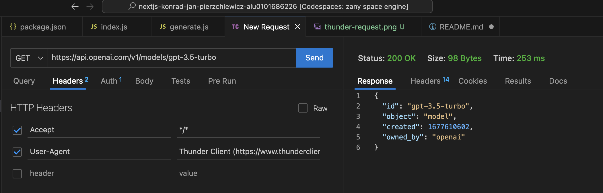

# Project Overview
The primary objective is to build a Node.js application using the Next.js framework and seamlessly integrate it with OpenAI's API.

# Features

1. Pet Name Generation: Users could input an animal type and receive generated names for their pets.
2. Image Fetching: The application would fetch and display images based on the provided animal name.

# Project Structure

pages: Contains primary pages such as the home page, about page, pet name generator, and image fetcher.
api: Hosts backend logic for interacting with the OpenAI API.
public: Stores static assets like images and icons.
docs: Houses documentation and images explaining various aspects of the project.
styles: Includes CSS modules for styling the application.
Setup and Installation
To set up the project:

Clone the repository.
Run npm install to install dependencies.
Configure the .env file with your OpenAI API key.
Start the development server using npm run dev.
Challenges and Limitations
The primary challenge encountered during the project was the depletion of the OpenAI API quota. This limitation prevented the full implementation of the pet name generation and image fetching features. Nonetheless, the application's architecture and code are ready for immediate activation of these features upon API quota restoration.

Future Enhancements
Upon reinstating API access, the following enhancements can be made:

Implement fully functional pet name generation.
Enable image fetching and display based on user input.
Incorporate additional styling and user interface improvements.
Conclusion
This DMSI Lab project signifies a valuable learning experience in integrating external APIs with a Next.js application. Despite the encountered limitations, the project establishes a robust foundation for future enhancements and complete functionality.

---x---

For any inquiries or contributions, feel free to open an issue or a pull request in the project's GitHub repository. Your feedback and contributions are highly appreciated.

OpenAI API Queries
Various requested queries have been executed, including:

Retrieving all models.
Gathering information about a specific model.
Fetching an awesome image*.
Retrieving a completion*.
Obtaining a moderation*.
Pet Name Generator Website
The file index.js presents the interface for the homepage and the code to make a fetch request for a random name based on the user's input.

The fetch redirects the query to the /api/generate route where an unnamed exported function creates the completion, returning the pet's name.

Deployment on Netlify
The project is deployed using Netlify's UI.
Netlify

Deployment on Vercel
Deployment is also carried out on the Vercel development and deployment platform.
Vercel

Dynamic Routes Exercise
The exercise involves creating a blog with various posts using dynamic routing mechanisms. Key functionalities in the code include:

Functionalities:
1. Imports:
Importing necessary elements like the header (Head), layout (Layout), styles (utilStyles), functions to get sorted data (getSortedPostsData), links (Link), and the date component (Date).
2. Main Function (Home):
Defining a functional component named Home representing the main page of the blog.
Using the Layout component and setting the page title with the site name (siteTitle).
Including two sections: one for a personalized introduction and another to display blog posts.
3. Personalized Introduction:
The first section includes a paragraph for a brief personal introduction.
4. Blog Post Listing:
The second section presents a header (h2) titled "Blog".
Displays a list (ul) of links to blog posts.
Each post is listed with a link (Link) to its details, the post title, and the publication date.
5. Static Data Fetching (getStaticProps):
Using the getStaticProps function to fetch and sort all blog post data.
Returning these data as properties (allPostsData) for rendering the page.
Colleagues provided assistance in solving the last task.

*Note on Pet Name and Image Generation Features: Due to quota limitations with the OpenAI API, the features to generate pet names and images could not be realized in this iteration of the project.

The content of the file has been preserved, and the structure of the document has been maintained. If you have any specific requests for modifications or additional information, feel free to let me know!