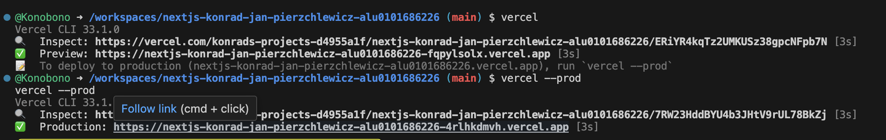

# Project Overview
The primary objective is to build a Node.js application using the Next.js framework and seamlessly integrate it with OpenAI's API.
Below is an example of a request to the OpenAI API using the Thunder Client extension in VSCode.

All requestst:
  - Get all models.
  - Obtain information from a model.
  - Get a cute image.
  - Obtain a completion.
  - Get a moderation.

# Deployment in Netlify

Because of the permission issues, I can't Netlify my deployment. I don't have the permission to use my repository (it is the second time that this happens, also before in previous assignments)

# Deployment in Vercel

I deployed my project in Vercel. Below a screenshot of the deployment.

https://vercel.com/konrads-projects-d4955a1f/nextjs-konrad-jan-pierzchlewicz-alu0101686226/ERiYR4kqTz2UMKUSz38gpcNFpb7N

# Features

1. Pet Name Generation: Users could input an animal type and receive generated names for their pets.
2. Image Fetching: The application would fetch and display images based on the provided animal name.

# Project Structure

pages: Contains primary pages such as the home page, about page, pet name generator, and image fetcher.

components: Includes reusable components like the header and layout.

api: Hosts backend logic for interacting with the OpenAI API.

public: Stores static assets like images and icons.

styles: Includes CSS modules for styling the application.

# Dynamic Routes

The application doesn't use dynamic routes to generate pet names and fetch images. But theoretical funcitionality of dynamic routes would be as presented:
1. The pet name generator page uses the animal type as a query parameter to generate pet names. 
2. The image fetcher page uses the animal name as a query parameter to fetch images.

# Problems encountered

I have encountered an Error 429 - quota exceeded. I have tried to solve it, but nothing worked. I guess only a paid plan can solve this issue. Nevertheless the code is working, but I can't show it in the deployment.
